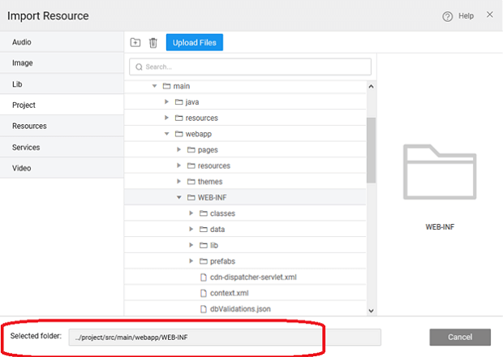
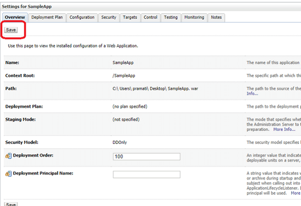

Apps can be exported as a WAR file. This generated file can be deployed to any standard Java Web Server running on JDK 1.8. You can know more about [to Web Server](/learn/app-development/deployment/deployment-web-server/) from here.

section walks through the steps to deploy WaveMaker app to Oracle WebLogic Server.

## \-requisites

1. Server needs to installed in the system. [here](http://www.oracle.com/technetwork/middleware/weblogic/downloads/wls-main-097127.html) for installation. **:** The following instructions are for deployment to **Server 11g (10.3.6)**
2. WebLogic XML for defining classloading policies and other instructions.
3. application (war) file. The following instructions assume the war file is named **, ** the name as per your use case.

## Involved

1. WebLogic.xml file in project
2. Application War file for WaveMaker app
3. Application (Deployment Process)

## WebLogic XML file in project

1. the following [file](../assets/weblogic.zip) and extract the WebLogic XML file.
2. the WaveMaker app and [the extracted file](http://[supsystic-show-popup id=112]) into project. Make sure it is imported to the following location: \[project\_home\]/src/main/webapp/web-inf

## Application War file

[Project](http://[supsystic-show-popup id=116]) as war. [here](/learn/app-development/deployment/deployment-web-server/#war-file-generation) for steps in war file generation for WaveMaker apps.

## Application to WebLogic (Deployment Process)

1. in to WebLogic server
2. the section (link on the left side menu), click the button.
3. the path to the location of war file in the text box, select the _file_ and click the button.
4. ' _this deployment as an application_' and click the button.
5. the app and click the  button.
6. '_, take me to the deployment's configuration screen_' and click the button.
7. the button in deployment settings page
8. the tab to access the deployed application.

**to WebLogic**

- [Prerequisites](#prerequisites)
- [Steps Overview](#steps)
    - [Setting WebLogic xml file](#xmlfile)
    - [Generating app war file](#warfile)
    - [Deployment Process](#deployment)
