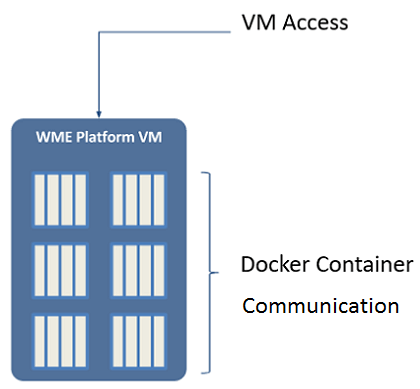

you will find instructions to setup & launch WaveMaker Enterprise (WME) using the WaveMaker Setup Portal. This section talks about the pre-requisites, requirements and verification needed before proceeding with the WME Setup.

## \- an Overview

Before proceeding with the set up, let us take a look at what constitutes WaveMaker Enterprise (WME). WME platform is made up of the following three components:

1. Studio - a modern RAD platform for collaborative development of multi-device apps,
2. Cloud - a container based platform for app deployments within a private cloud, and
3. \- WaveMaker's administrative console where you can configure users, additional Studio/Cloud instances for scaling, configure external VCS, etc. Launchpad is automatically installed when you setup WaveMaker Enterprise .

WME utilizes Docker containers to segregate and isolate the platform components and the developer workspace as depicted below: 

1. **Containers** consisting of multiple internal services needed to run the WME platform like Studio, Cloud, VCS etc.. Each of these services runs in a separate Docker Container. Services talk to each other via REST service. Platform Containers make calls to the Docker Engine for operations like starting a new user container, stopping / starting a container etc..
2. **Container**: Each user gets a container for developing apps. Containers are used to isolate each user’s workspace from other users. Each WaveMaker app that is deployed into the internal WaveMaker Cloud is allocated a separate container. Thus the deployed apps are also isolated from each other.

## to Launch WME

can launch WaveMaker Enterprise as a VM or as an AWS EC2 instance. The prerequisites differ based upon your preferred mode of setting up WaveMaker Enterprise.

**      Click the appropriate section for the exact prerequisites.**WME as a VM The following are prerequisites to install a VM to run WaveMaker Enterprise on your host machine. The below-mentioned system requirements allow for limited app developments and deployments. You can increase this capacity by adding Studio and Cloud instances thus scaling your WME.

### VM System Requirements

Before you start setting up the WaveMaker Enterprise VM, here is a list of a minimum and recommended System Requirements for the WME VM:

- 16GB

- 4-cores, single CPU system
- Virtualization Technology (VT-x) enabled
- (HT) disabled

**Disk**

- 300 GB to be allocated to VM

- IP with valid DNS
- 80, 443, 8080

**Platform**

- ESXi 5.1+
- Oracle VirtualBox 4.3.36
- VMware Workstation Pro 12

**OS**

- 14.04.3 LTS or
- 2012 R2 Server or
- 7 or
- 10

#### Requirements for Additional Instances

an instance to either Studio or Cloud aids in the scalability of the VM in terms of application development and deployment, respectively. Each added Studio and Cloud instance would allow for a specific number of app developments and app deployments. These numbers will vary based on the WME version, refer to the table below for the exact numbers.

Version

logins per 16GB WaveMaker Studio Instance

Deployments per 16GB WaveMaker Cloud Instance

10.0

14

22

9.4.0

14

22

The actual app development and deployment support are further determined by your license terms. This means that, even if your infrastructure has the capacity, the apps that can be developed and deployed is restricted by your license terms. Similarly, even though your license terms allow, the apps that can be developed and deployed are limited by the infrastructure capacity.  different Cloud instance needs to be added to each stage in the release pipeline as explained in the Increasing Deployment Capacity section. For  **instance to be added**, the following requirements should be met:

- 16 GB

- 4-cores, single CPU system

**Disk**

- 200 GB

- IP with valid DNS
- to be opened on added instance for access from platform VM:
    - : TCP: 22, 80, 2375, 8301, 2200-2299, 8000-8099
    - : 8301, ICMP80, 443, 8080
- ports to be opened on platform VM for access from instances:
    - : 5555, 8000, 8008, 8081, 8301
    - : 8301

**Platform**

- ESXi 5.1+
- Oracle VirtualBox 4.3.36
- VMware Workstation Pro 12

**OS**

- 14.04.3 LTS or
- 2012 R2 Server or
- 7 or
- 10

### VM File Requirements

The following files should be shared with you by the WaveMaker team:

- VM image file and its corresponding checksum (sha1sum) file, communicated to you by the WaveMaker team.
- Key (.zip format) issued by WaveMaker, communicated to you by the WaveMaker team.
- need to download the above files before starting the installation.
- the WME VM Image and its corresponding checksum file into the same directory.

### Checksum

Enterprise VM can be installed on Linux or Windows platform. You need to verify the WME VM image (.ova file communicated to you by the WaveMaker team) using checksum command before installing it.

To verify the WME VM image on Linux

- the following command, go to the directory where .ova file and checksum files are downloaded `# cd /home/ubuntu`
- verify the file integrity of the VM image, run the following checksum command: `# sha1sum -c [checksum-filename]`
- running the command, the result should be displayed as OK, which means the checksum is verified and the file is OK.

To verify the WME VM image on Windows

- , download the FCIV utility package (to download,  [instructions from here](https://support.microsoft.com/en-us/kb/841290#bookmark-4)) `# cd /home/ubuntu`
- download, from command prompt, run the following command: `-sha1 pathfilename.ext`
- Windows, after running the command, the result should be manually verified with the values present in their respective files (checksum file shared to you by email).

 (Applicable for both Windows and Linux): Do not proceed further to installation if checksum verification fails. Invalid checksum indicates a likely corrupted download. Try downloading the file again or contact  [Support](mailto: support@wavemaker.com) WME as an AWS EC2 instance The following are the prerequisites required to install WaveMaker Enterprise on your EC2 instance:

- Web Services (AWS) account
- Machine Images (AMI) ID of WaveMaker Enterprise (WME)
- Key (.zip format) issued by WaveMaker : AMI ID and License Key will be provided to you by the WaveMaker team through email communication. You need to download the License Key before starting the installation
- EC2 instance type has to be a m3.2xlarge or higher having the following minimum configuration:
    - : 4
    - (GiB): 30
    - Storage (GB): 3×50 including root partition

**on encryption**: If you require to encrypt the boot volumes within your AWS account, you may use the copy AMI feature to copy the shared AMI into an encrypted AMI using your keys. Please refer the AWS website for more information: [://aws.amazon.com/blogs/aws/new-encrypted-ebs-boot-volumes/](https://aws.amazon.com/blogs/aws/new-encrypted-ebs-boot-volumes/)

## Addressing

You will be needing IP Addresses for the following:

- static IP for accessing the VM from your network and
- IP range to be assigned to the Docker containers internally. 
- **Access**:
    - ’s Static IP: This is the IP assigned to VM during setup and should be accessible on your network, or
    - case of AWS instance: Private static IP for the instance within your VPC (assigned via eth0 or via ENI on eth1)
    - **Mapping**: Map a domain to the above IP for easy access:
        
        **URL**
        
        Studio/Cloud platform
        
        `[mycompany].com`
        
        domain will be used to access WaveMaker Studio and WaveMaker Cloud
        
        Deployed Apps
        
        `[mycompany].com` `[mycompany].com` `[mycompany].com`
        
        domains will be used to access WaveMaker Studio apps deployed onto WaveMaker Cloud
        
        Note: In the preceding table, `[mycompany]` is used as an example. You may have to replace `[mycompany]` with your appropriate domain name.
- **Container Access**: You will be needing to assign a /16 [ ](https://en.wikipedia.org/wiki/Classless_Inter-Domain_Routing#CIDR_notation) to Docker during setup. This IP range should not be in use anywhere on your network and can be completely different from your network’s range. These IPs are assigned internally by Docker to containers and these IPs won’t be exposed on your network. For example, if your network is using a _10.x.x.x_ range and the range _192.168.x.x_ is not used anywhere in your network, you may assign this _192.168.x.x_ range to Docker. See  for the possible LAN IP ranges.

2: Launch & Initialize WME

- [1\. Getting Started](#)
    - [WME - an Overview](#wme-overview)
    - [Prerequisites for WME Setup](#prerequisites-wme)
    - [IP Addressing](#ip-addressing)
- [2\. Launching & Initializing WME](/learn/installation/wme-setup-guide-launch-initialize/)
- [3\. Setting Up WME](/learn/installation/wme-setup-guide-access-setting/)
- [4\. Configuring WME](/learn/installation/wme-setup-guide-configuration/)
- [5\. Adding Capacity](/learn/installation/wme-setup-guide-adding-capacity/)
- [6\. Maintaining WME](/learn/installation/wme-setup-guide-maintenance/)
- [7\. Upgrading WME](/learn/installation/wme-setup-guide-upgrading/)
