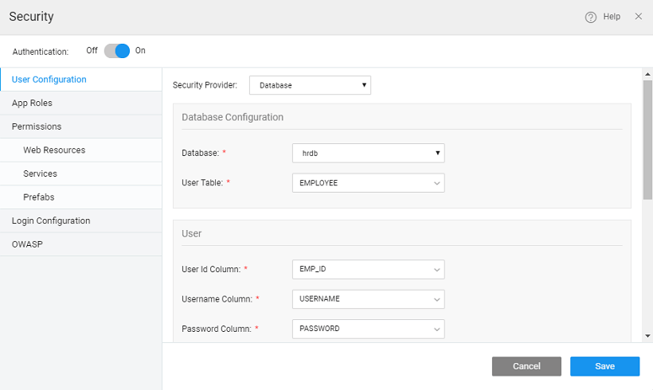
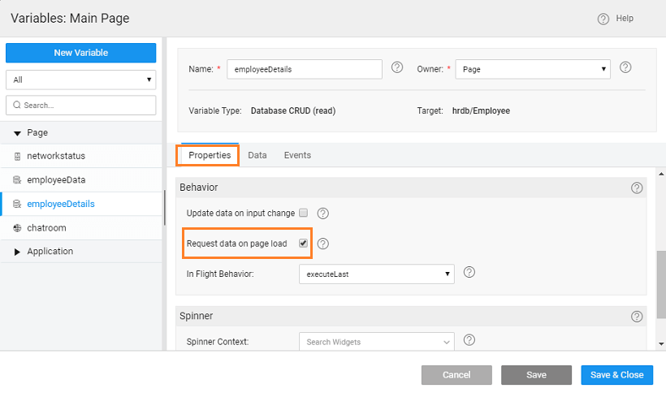
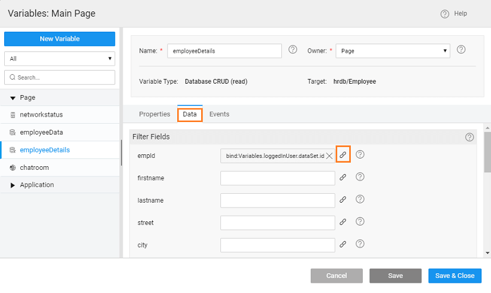
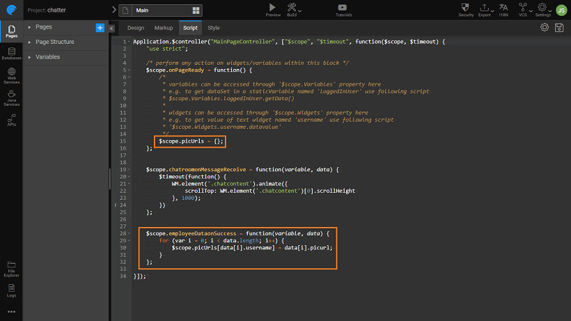
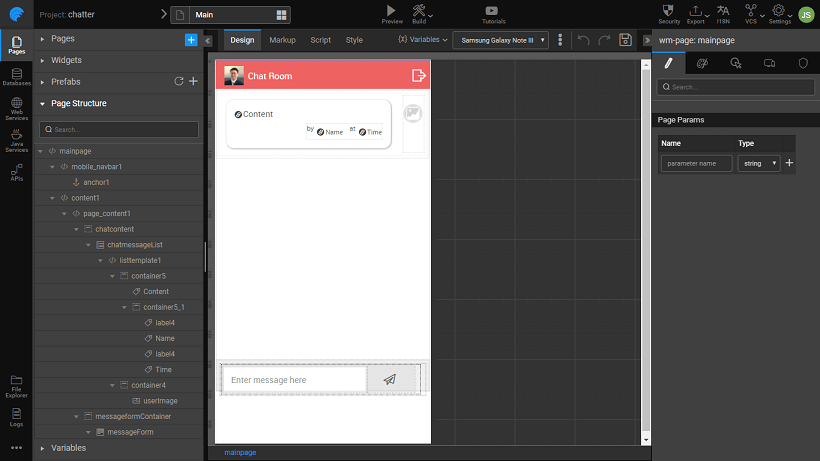

App utilizes a WebSocket service to enable chat among multiple users.

**1:** WebSocket Service Import

- a mobile project
-   **Service** resource, add new web resource and select

**2:** Test the WebSocket service

- the service URL (Use the `://` url eg. here we are using `://websocket-demos.wavemakeronline.com:443/websocket/chatroom?username=user1`)
- Sample Request Body

- the connection is established successfully with the service, the client will start receiving messages from the service and display it under the MESSAGES section.
- one of the response messages by clicking on radio button on the left. This will help the platform to generate metadata info against the service. This metadata will be helpful while binding the corresponding WebSocket Variable with widgets. 
- the server does not respond with any message or the message you are expecting at runtime is different, you can provide the same manually in the editor under the SAMPLE RESPONSE section.  note providing Sample Response is useful only if the target WebSocket service returns homogenous data. If the data is heterogeneous, selecting a sample response is not going to be much of a use as you will end up writing JavaScript code to deal with different data structures returned by the service.

**3:** Configure the service and import

- - successfully testing the service, click button to configure the service with any parameters if required.
    - the service requires query params, they will show up under the query params section. You can make the path of the URL dynamic by adding path params under the second tab.
    - a name to the service (in this case ) and click on and the service will be successfully imported into the project.

**4:** **a WebSocket Variable** against the service

This variable is an interface between client and server. Follow below steps to create the variable:

- the page where you want to use the chat service
- [a Web Service Variable](http://[supsystic-show-popup id=105])
-  (WebSocket service name entered while import) against the property.
- the variable a name (in this case **)**
- the Variables dialog:
    
    - the properties **on page load** and set **New Data** to  _as last record in dataSet (_ we want to display the latest message at the bottom of the list)
    -   **& Close** to save the variable.
    
    

**5:** Secure the app

1. will be using a Database for login details
    - [the Database](http://[supsystic-show-popup id=106]) with the login details (here we will be using the sample hrdb Employee table
2. [Security](http://[supsystic-show-popup id=111]) and use Database as Service Provider
3. the Security as follows: 

**6:** Create a** DB CRUD Variable** to get the logged in user details

This variable will get the logged in employee details. Follow below steps to create the variable:

1. [a Database CRUD Variable](http://[supsystic-show-popup id=105]) (in this case ****) for   entity.****
    - the properties **data on page load**
    - the  tab, set  Filter Field to using the bind icon next to the empId

  **7:** Create a **Database CRUD Variable** to get all user details

This variable will get employee details to be displayed against the chat messages. Follow below steps to create the variable:

1. [a Database CRUD Variable](http://[supsystic-show-popup id=105]) for   entity (in this case ****).****
    - the properties **data on page load**
    - the  tab, set  **Success** to trigger  Enter the following code to retrieve the picurl of the employees:
        
            $scope.employeeDataonSuccess = function(variable, data) {
                for (var i = 0; i < data.length; i++) {
                    $scope.picUrls\[data\[i\].username\] = data\[i\].picurl;
                }
            };
        

   **8:** We will design the Chat Room page 

1. have chosen **column layout with top navbar** for the Main Page
2. the top navbar and set:
    - as _Room_
    - **Source** as the
3. and drop a Use  the **Source**
    - to Chatroom -> username field
    -   to  Chatroom -> time field
4. the canvas
    - the label Use Expression to set the time format to: _: 'hh:mm:ss a'_
    - the widget Use Expression to set it to the appropriate picurl: _\[Widgets.chatmessageList.currentItem.username\]_
5. and drop a **Layout** inside the Panel Footer. Set:
    - 1 width = 10
    - 2 width = 2
    - and drop   in GridColumn 1
    - and drop a in Grid Column 2. Set
        - **Class **\= _wi-paper-plane_
        - **Click** to

**9:** Variable Binding.

1. Chatroom WebSocket Service Variable. From the Data tab, bind
    
    - to ,
    - the returned by widget
    
    

**7:** Run the app

1. three instances of Chatroom app and login as three different users.
2. one user sends a message, remaining users will receive the message in real time.
3. remaining users send messages, the other users also receive it back in real time.
