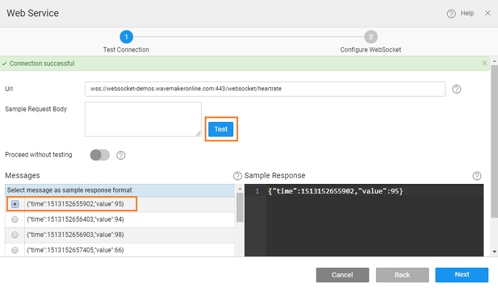

##### 8.4 Release

Monitor App utilizes a WebSocket service that returns a patient’s heart rate every half a second. The app will show last 20 heart rates in a Data Table, plot the same on a Line Chart and highlight the last recorded details next to it.

**1 :** WebSocket Service Import 

- a web responsive project
- option from **Menu**
- **Service** and select **Socket**

**2:** Test the WebSocket service

- the **URL** ( the wss:// url eg. here we are using `://websocket-demos.wavemakeronline.com:443/websocket/heartrate`)
- message body (if it requires),

- connection is established successfully with the service, client will start receiving messages from the service and display it under the section. 
- one of the response messages by clicking on radio button on the left. This will help the platform to generate metadata info against the service. This metadata will be helpful while binding the corresponding WebSocket Variable with widgets. 
- the server does not respond with any message or the message you are expecting at run time is different, you can provide the same manually in the editor under the SAMPLE RESPONSE section.  note providing Sample Response is useful only if the target WebSocket service returns homogenous data. If the data is heterogeneous, selecting a sample response is not going to be much of a use as you will end up writing JavaScript code to deal with different data structures returned by the service.

**3:** Configure the service and import

- successfully testing the service, click button to configure the service with any parameters if required.
- the service requires query params, they will show up under the query params section. You can make the path of the URL dynamic by adding path params under the second tab.
- a name to the service (in this case ) and click on Import and the service will be successfully imported into the project.

 **4:** Create a WebSocket Variable against the service

variable is an interface between client and server. Follow below steps to create the variable:

-  option from **Menu**

- _Variable_ against the of Variable.
- against the property.
- the properties **on page load** and set **New Data** to _as Last Record_
- the variable a name (in this case )
-   **& Close** to save the variable.

 **5:** Drop the required widgets and bind them to the WebSocket Variable.

- a **Table**
    - the _variable_ created above as **Source**
    - _node_ of the variable as the data source for the widget. 
- a
    
    - abovementioned _variable_ as value of the chart.
    - “” for **\-axis** and “” for **\-axis**
    
    
- **labels** and bind them to and of the WebSocket Variable.

done, the UI should something like below (we have used Grid Layout for proper arrangement of various widgets)  **6:** Run the app 
