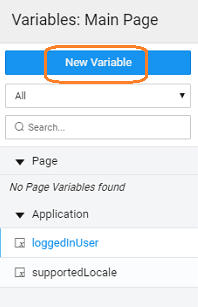

**Variable** is the interface for the app developer to interact with a WebSocket Service imported into a WaveMaker app. The Variable has methods to interact with the target service like opening and closing the connection, sending and receiving messages to and from the server. It also holds the data to be sent to the service and the data received from the service.

# Lifecycle

# Creation

The **data source** for WebSocket Variables comes from a _ Service_ We will see steps in creating a WebSocket variable here.

1. Variable option from the Create Menu 
2. New Variable from the Variable Dialog 
3. will initiate Create Variable wizard with the following steps:
    1. we are creating a variable to access WebSocket Web service APIs, select ** Service ** the target action
    2. :
        - \- service (already imported) name,
        - \- is set by default but can be modified
        - \- the scope of the Variable being created. By default it is set to Page, you can change it to Application if you want this variable to be available across the app
    3. to complete the variable creation process
    4. will be directed to the Variables page, with the new variable listed. As you can see:
        1. **Service** Variable is created,
        2. the default exposed method/selected method as target
        3. **tab** contains all the properties like and behavior. [more about properties](#properties)
        4. **tab** will contain the fields serving as _fields_ for the API
        5. tab will contain the events that can be configured to trigger any action. [more about events](#events)

Variables are special variables that interact with the imported Web Socket service.

WebSocket service targeted for the Variable.

on page load

set to true, the variable will open the connection between the client and target WebSocket service on:

- load, for a page variable
- load, for an app variable.

New Data

client once connected to a WebSocket service, can receive messages at any point in time and can receive a number of messages sequentially. This property determines what to do with data received from the variable.

- _dataSet:_ dataSet will be updated with the data received.
- _as last record:_ data will be appended at the end of dataSet. Latest data will be the last record in dataSet.
- _as first record_: data will be prepended at the beginning of dataSet. Latest data will be the first record in dataSet.

latter two cases, dataSet will always be a list of messages.

Limit

number of messages that dataSet will hold. This is applicable only if “On New Data” property is set to other than “Refresh”. E.g. if set to 10, dataSet will hold a maximum of 10 message received from the server. When a new message is received, the first message is removed from the dataSet and the new one is appended to the end. Set it to 0 if no such upper limit is required.

events are triggered during the lifecycle of a WebSocket Variable. These events can be utilized by the end user application developer to customize the behavior of the app through more complex logic.

Before Open

event is triggered just before the Variable attempts to establish a connection between the client and target WebSocket service. If returned false from here, the connection establishment will be aborted.

Open

event is triggered right after a successful connection is established between the client and the WebSocket service through the Variable.

Before Message Send

event is triggered just before the Variable attempts to send a message to the target service through the existing connection. You have a chance at this point to validate and edit the data to be sent to the service. Returning false from this event will prevent the message to be sent to the service.

Message Receive

event is triggered on the Variable when a message is received from the WebSocket service in an existing connection made by the Variable.

Error

if an error is encountered in establishing a connection with the server in the open phase.

Before Close

before an existing connection(opened by the Variable) is closed. Returning false from here will abort the closing of the connection.

after the connection is closed.

: WaveMaker supports binding multiple actions to a given event, i.e. a given event can trigger multiple actions.

## ()

This method is used to open up the connection between the client and the WebSocket service. This is the starting point of the Variable lifecycle. : None _Value_: None

_:_

();

## ()

This method is used to send a message to the WebSocket service through the currently established connection.

:

- (object): the message to be sent to the service. If not provided, whatever is assigned to Variable RequestBody will be sent

_Value_: None

_:_

(message);

## ()

This method is used to close an existing WebSocket connection connected through the Variable.

: None _Value_: None

_:_

();

5\. Data Integration - Variables

- [5.1 Variables](/learn/variables/data-integration/)
    - [Overview](/learn/variables/data-integration/#)
    - [Scoping](/learn/variables/data-integration/#scoping)
    - [Data Storage](/learn/variables/data-integration/#data-storage)
    - [Variable Types](/learn/variables/data-integration/#variable-types)
        - a. Live Variables
            - [Overview](/learn/variables/live-variable/#)
            - [Creation](/learn/variables/live-variable/#creation)
            - [Properties](/learn/variables/live-variable/#properties)
            - [Events](/learn/variables/live-variable/#events)
            - [Methods](/learn/variables/live-variable/#methods)
        - b. Login Variables
            - [Overview](/learn/app-development/variables/login-variable/#)
            - [Creation](/learn/app-development/variables/login-variable/#creation)
            - [Properties](/learn/app-development/variables/login-variable/#properties)
            - [Events](/learn/app-development/variables/login-variable/#events)
        - c. Logout Variables
            - [Overview](/learn/app-development/variables/logout-variable/#)
            - [Creation](/learn/app-development/variables/logout-variable/#creation)
            - [Properties](/learn/app-development/variables/logout-variable/#properties)
            - [Events](/learn/app-development/variables/logout-variable/#events)
        - d. Service Variables
            - [Overview](/learn/app-development/variables/service-variable/#)
            - [Creation](/learn/app-development/variables/service-variable/#creation)
            - [Properties](/learn/app-development/variables/service-variable/#properties)
            - [Events](/learn/app-development/variables/service-variable/#events)
            - [Methods](/learn/app-development/variables/service-variable/#methods)
        - e. Static Variables
            - [Overview](/learn/app-development/variables/static-variable/#)
            - [Creation](/learn/app-development/variables/static-variable/#creation)
            - [Properties](/learn/app-development/variables/static-variable/#properties)
            - [Methods](/learn/app-development/variables/static-variable/#methods)
        - f. Timer Variables
            - [Overview](/learn/app-development/variables/timer-variable/#)
            - [Creation](/learn/app-development/variables/timer-variable/#creation)
            - [Properties](/learn/app-development/variables/timer-variable/#properties)
            - [Events](/learn/app-development/variables/timer-variable/#events)
            - [Methods](/learn/app-development/variables/timer-variable/#methods)
        - [WebSocket Variables](#)
            - [Overview](#)
            - [Lifecycle](#lifecycle)
            - [Creation](#creation)
            - [Properties](#properties)
            - [Events](#events)
            - [Methods](#methods)
        - h. Navigation Variables
            - [Overview](/learn/app-development/variables/navigation-variable/#)
            - [Creation](/learn/app-development/variables/navigation-variable/#creation)
            - [Properties](/learn/app-development/variables/navigation-variable/#properties)
            - [Methods](/learn/app-development/variables/navigation-variable/#methods)
        - i. Notification Variables
            - [Overview](/learn/app-development/variables/notification-variable/#)
            - [Creation](/learn/app-development/variables/notification-variable/#creation)
            - [Properties](/learn/app-development/variables/notification-variable/#properties)
            - [Events](/learn/app-development/variables/notification-variable/#events)
            - [Methods](/learn/app-development/variables/notification-variable/#methods)
    - [Operations or APIs](/learn/variables/data-integration/#variable-operations)
    -   [Variable Events](/learn/variables/data-integration/#variable-events)
    - [Error Handling](/learn/variables/data-integration/#error-handling)
- 5.2 Variable Binding
    - [Overview](/learn/variables/variable-binding/#)
    - [Data Binding](/learn/variables/variable-binding/#data-binding)
    - [Widget Binding](/learn/variables/variable-binding/#widget-binding)
    - [Binding Options](/learn/variables/variable-binding/#binding-options)
- 5.3 JavaScript Access
    - [Overview](/learn/variables/accessing-elements-via-javascript/#)
    - [Widget Controllers](/learn/variables/accessing-elements-via-javascript/#widget-controllers)
    - [Page Scripting](/learn/variables/accessing-elements-via-javascript/#page-scripting)
    - [Script Access](/learn/variables/accessing-elements-via-javascript/#script-access)
