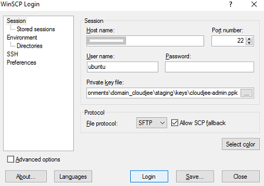
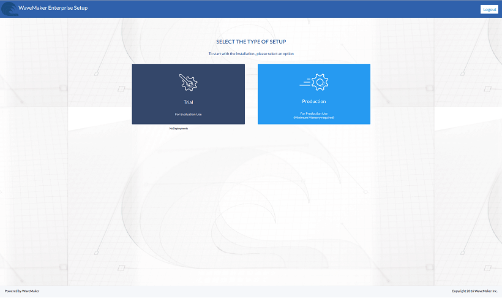
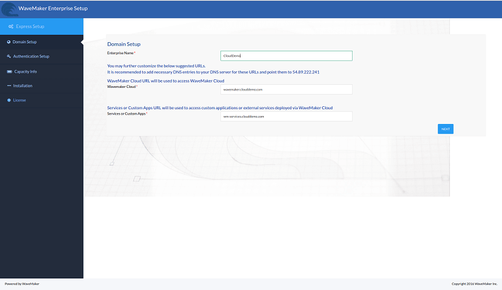

This section talks about initializing and setting up the WME. This step comes after you have [ Instances](/learn/installation/wme-setup-guide-launch-initialize/)

## and Copy the WME Setup files

1. the WME installer file and its checksum (sha1sum) file from the email.
2. next few steps are dependent upon your host machine operating system _1: Linux as host machine_
    
    - the below SCP command, copy the downloaded files from your host machine to the WME instance. When prompted, enter the password (as shared by the WaveMaker team). command for WME Installer file: `# scp -P 22 [WME Installer filename] ubuntu@[IPADDRESS]:~/ ` command for WME VM Patch checksum (sha1sum) file: `# scp -P 22 [WME Installer sha1sum] ubuntu@[IPADDRESS]:~/ ` command for WME running on AWS instance: `# scp -i [pem file along with path] [source file path] ubuntu@[path to remote destination]:~/` Use the same  file that you generated while installing the WME VM
    - above command will copy the files to /home/ubuntu directory inside the WME instance.
    
    _2: Windows as host machine_
    - and install WinSCP installer in your Windows host machine.
    - WinSCP after installation.
    - Hostname, Username and Password and click Login.  ** case of AWS installation**, you need the use the  file instead of the password 
    - 'Yes' when the Unknown server warning is displayed. 
    - the password when prompted (communicated to you by the WaveMaker team). 
    - you are connected to the Machine from your Windows host machine.
    - for VM users: Drag and drop the WME Installer file and WME Installe checksum file from the Windows machine to theMachine /home/ubuntu location. 
    - 'Ok' on the upload dialog. 
    - patch and checksum/private key files will start copying to the WME machine. Wait until the patch and checksum/private key files are copied to the machine.

## WME Installer file & verifying

The instructions in this section vary depending upon the host machine operating system. Follow the appropriate set. _1: Linux Host Machine_

1. the terminal
2. the WME machine using the SSH (secure shell) command. `# ssh ubuntu@[IPADDRESS]:~/` For AWS Installation: `-i [ssh-private-key] ubuntu@[IPADDRESS]`
3. to root access `@wavemaker:~$ sudo su -`

_2: Windows Host Machine_

1. and install  [installer](https://winscp.net/download/putty-0.67-installer.exe) in your Windows host machine
2. PuTTY after installation
3. the machine IP address in the Host Name field and select SSH option. Click 'Open' button 
4. case of  **installation**, under  ->  option add the  _key file_ 
5. 'Yes' on the PuTTY security Alert dialog 
6. the Username and password when prompted (as provided by the WaveMaker team) 
7. to root access `@wavemaker:~$ sudo su -`

You need to verify the WME setupfiles using checksum command before installing it,  [here for details](/learn/installation/wavemaker-enterprise-setup-guide/#verifying-checksum-vm)

## WME

After verifying the checksum:

1. to root user . Setup process needs root permissions.
    - su -
2. and Mount Disks in case of  setup on AWS/Azure/GCP etc cloud prioviders. Execute below commands.
    - disks and format them.
        
        - _4 <disk1>_ _4 <disk2>_
    - directories and mount disks
        - _\-p /wm-data_ _\-p /wm-runtime_ _<disk1> /wm-data_ _<disk2> /wm-runtime_
        - below entries in /etc/fstab file (Note: Make sure not to have duplicate entries with same device names). To prserver these setting after reboot.
            - <disk1> /wm-data ext4 defaults,nofail 0 2 <disk2> /wm-runtime ext4 defaults,nofail 0 2
3. the setup file (Debian package) using the following command.
    - _\-i \[WME-Installer-filename\]_
4. the package gets extracted successfully,  You will be seeing a message with a command to start the WaveMaker installation. Run the command.
    - _/usr/local/content/wme/wme-installer/\[installer-version\]/wme-installer.sh_
5. running the above command, it prompts you with WME pre-setup configuration process.
6. the ethernet interface name in the VM as **0** or **1** or **5 **(typically eth0 for VMware or Virtual Box based VMs, **5 for ** EC2 )
7. will be seeing IP address assigned to given interface. Press Y to processed if it matches with machine private IP.
8. the IP range in CIDR notation for internal use by the WME. This should not conflict with the local LAN IP range. Refer the  for details. : IP address representation and its associated routing prefix.

Once the WME pre-setup configuration is successfully completed, you will see a success message. You need to access the auto populated URL (:<IP-of-WME-VM>:<port-number>) which needs to be opened in a browser.

## WaveMaker Enterprise

can access WaveMaker by one of the following ways:

- the DNS Names in your enterprise routers with help of the IT or,
- the IP address and DNS names in the hosts file on the system accessing WaveMaker.

Example of the Host Entries:

<ip address>  wavemaker.\[mycompany\].com 
  qa.wmcloud.\[mycompany\].com
  stage.wmcloud.\[mycompany\].com
  live.wmcloud.\[mycompany\].com

:

- the above Host Entries, is used as an example. You may have to replace with your appropriate domain name.
- IP address in the above Host Entry example is the same IP address that is displayed after successfully completing the WME Network Configuration.

For machine, make the host entries in `:WindowsSystem32driversetchosts` file as shown in the above example. For machines make the host entries in `/etc/hosts` file as shown in the above example. You may require to get IT assistance for this.

## up WaveMaker Enterprise

To start the WME Setup, access the above-mentioned URL and follow the steps in the WaveMaker Enterprise Setup wizard:

1. **Setup**:
    1. _\-admin_ as and set a password of your choice.
    2. will then be redirected to WME login page where you can log in as setup-admin using the password you set.
2. will be prompted to select the setup type to be Trial or Production based on your requirement and license. 
3. **Setup**: Enter your Enterprise Name. Once you enter the Enterprise Name, domain names for WaveMaker Studio and WaveMaker Built Apps are auto-generated. You may replace these as per your requirement. : Based on the selection of the setup, the list of required DNS Entries is displayed. 
4. **Setup**: Use the form to create an Admin user, entering the email id, password, first and last name and click Next 
5. **Info**: The capacity allocation is non-editable and fixed based on the type of setup selected. Click Proceed with Installation 
6. : The installation process initiates and it takes a while to start, configure and run the services. 

Once the installation process is completed successfully, click on Apply License to continue further. Make sure the License File is already downloaded to your local machine. : License File can ALSO be uploaded from the [section of Launchpad](/learn/installation/wme-setup-guide-configuration/#uploading-license)  : While launching WaveMaker, if installing services fails refer to [ section](/learn/installation/wme-setup-guide-maintenance/#troubleshooting)

## License

1. the License File from your local machine and click on **License Details** You can review your License details and continue further. 
2. **License** On the bottom right corner, you will get a success message once the license is uploaded successfully. : To avail the full benefits of the License in terms of Developers and Nodes (Apps), instances need to be added appropriately. See [Capacity](/learn/installation/wme-setup-guide-adding-capacity/) for more details.
3. on **To Launchpad** 

**Note**: Make sure you have the host entry made as mentioned above.

4: Configuring WME from Launchpad

- [1\. Getting Started](/learn/installation/wavemaker-enterprise-setup-guide/)
- [2\. Launching Instances](https://www.wavemaker.com/learn/installation/wme-setup-guide-launch-initialize/)
- [3\. Setting Up WME](#)
    - [Download & Copy](#download-copy)
    - [Access and Verify](#patch-access)
    - [Initializing WME](#initializing-wme)
    - [Accessing WME](#accessing-wme)
    - [Setting up WME](#setting-up-wme)
    - [Uploading License](#uploading-license)
- [4\. Configuring WME](/learn/installation/wme-setup-guide-configuration/)
- [5\. Adding Capacity](/learn/installation/wme-setup-guide-adding-capacity/)
- [6\. Maintaining WME](/learn/installation/wme-setup-guide-maintenance/)
- [7\. Upgrading WME](/learn/installation/wme-setup-guide-upgrading/)
