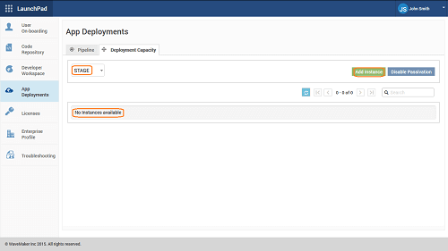
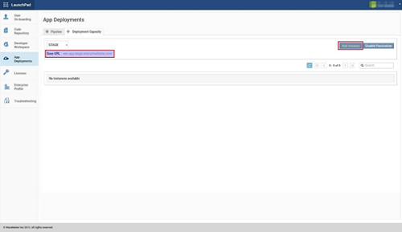

you have , , [up](/learn/installation/wme-setup-guide-access-setting/#setting-up-wme) and  the WME, it is time for the developers to log in and build apps. For this, you need to add developer and deployment infrastructure capacity by adding instances.

In this document, we will explain how to add/increase the developer and deployment capacity of your WME setup.By default, WME installation allows for limited capacity for app development in WaveMaker Studio and app deployments onto WaveMaker Cloud. You can increase this capacity by adding Studio and Cloud instances thus scaling your WME.

: In this document, when we say App Deployment we are referring to deployment to WaveMaker Cloud.

## Development & Deployment Capacity

an instance to either Studio or Cloud aids in the scalability of the VM in terms of application development and deployment, respectively.  Each added Studio and Cloud instance would allow for a specific number of app developments and app deployments. These numbers will vary based on the WME version, refer to the table below for the exact numbers.

Version

logins per 16GB WaveMaker Studio Instance

Deployments per 16GB WaveMaker Cloud Instance

10.0

14

22

9.4.0

14

22

The actual app development and deployment support are further determined by your license terms. This means that, even if your infrastructure has the capacity, the apps that can be developed and deployed is restricted by your license terms. Similarly, even though your license terms allow, the apps that can be developed and deployed are limited by the infrastructure capacity.

To add instances, you must first launch an additional machines (VM/EC2 instances) by following steps mentioned   [Instances](https://www.wavemaker.com/learn/installation/wme-setup-guide-launch-initialize/) in page.

Increasing Developer Capacity Adding Developer Workspace instances increases Development Capacity and allows more developers to use Studio subject to license.

1.  IP, Port, UserName, Password(or Key) for ssh access of the instance.
2. and from the **Workspace** section, you can add instances for app development or Studio.
3. on the **Workspace** page.
4. add new instances, click **Instance** 
    - the **Name** and **Address** of the new Instance (: The IP address should be the IP address of the external instance launched using the WME External Instance Image and NOT that of the WME Platform mechine).
    - **Port** is selected as 22 by default.
    - the credentials in the **Details** section (credentials will be shared with you by the WaveMaker team).
5. to verify the authentication details.
6. **Instance** Your instance is now added.

Once the instance is added, it will be in CONFIGURING state and the instance will be setup in the background. The instance will be ready for use, when the state changes to STARTED. Increasing Deployment Capacity Release Management feature helps ease the app life-cycle process. You can use this feature through the Apps Portal to add deployment environments to your projects and use them for a phased release of the app from QA -> Stage -> Live. To be able to push the code from one phase to another, your WME needs to be capable of handling the deployments.

There are _deployment phases_ provided by WME – , and

By default, QA Phase comes with an in-built capacity to deploy 2-3 apps to QA phase, depending upon the VM size. Stage and Live Deployment Phases do not come with any such in-built capacity, you need to add cloud instances else configuration of the phases for any project from Apps Portal will fail. Cloud Instances for all three phases can be viewed/added from the Capacity tab of the App Deployments section in Launchpad.  Adding Deployment instances increases Deployment capacity and allows more apps to be deployed, subject to license. Every deployed app is allocated 768MB of memory and is deployed into a separate container within the instance. Thus every 3 GB of memory provides capacity for 2 additional apps to be deployed. For example, adding a 16GB instance will support up to 22 deployed apps (after allowing approximately 3GB for the OS on the instance).

Cloud Instances for all three phases can be added to increase Deployment capacity. We will illustrate the steps in adding instances to Stage Phase. The same can be followed for the QA & Live Deployment Phases.

1. Stage from the drop down, you will see message “No Instances available”. 
2. **Instance** The first time you click Add Instance for a phase, you will be prompted to enter the Base URL if it doesn’t exist already. This URL will be used to access the Studio apps deployed to the phase. Each deployment phase requires a separate Base URL. This URL will be used to access the Studio apps deployed to the phase, this cannot be changed later. Corresponding DNS entries need to be added to your DNS server for this Base URL to be resolved to the WaveMaker Studio IP.
3. **URL** and click 
4. the Base URL is set, click **Instance** to add the Instance Details. 
5. the **Name** and **Address** of the new Instance (: The IP address should be the IP address of the external instance launched using the WME External Instance Image and NOT that of the WME Platform Instance)
    
    1. **Port** is selected as 22 by default
    2. the credentials in the **Details** section (credentials will be provided by the WaveMaker team).
    3. to verify the authentication details.
    
    
6. **Instance** Your instance is now added.

Once the instance is added, it will be in CONFIGURING state and the instance will be setup in the background. The instance will be ready for use, when the state changes to STARTED. Follow the same steps for setting up the other Phases. Refer here to learn more on how to use the [Management](/learn/app-development/deployment/release-management/) feature.

7: Maintaining WME

- [1\. Getting Started](/learn/installation/wavemaker-enterprise-setup-guide/)
- [2\. Launching Instances](https://www.wavemaker.com/learn/installation/wme-setup-guide-launch-initialize/)
- [3\. Setting Up WME](/learn/installation/wme-setup-guide-access-setting/)
- [4\. Configuring WME](/learn/installation/wme-setup-guide-configuration/)
- [5\. Adding Capacit](/learn/installation/wme-setup-guide-adding-capacity/)
- [6\. Maintaining WME](/learn/installation/wme-setup-guide-maintenance/)
- [7\. Upgrading WME](/learn/installation/wme-setup-guide-upgrading/)
