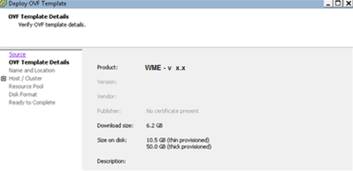
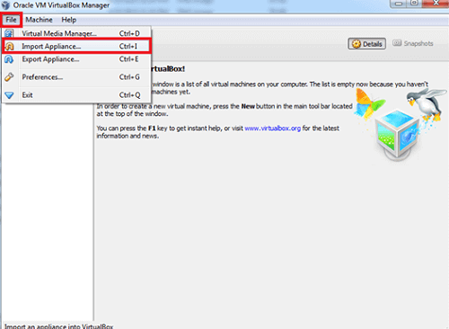
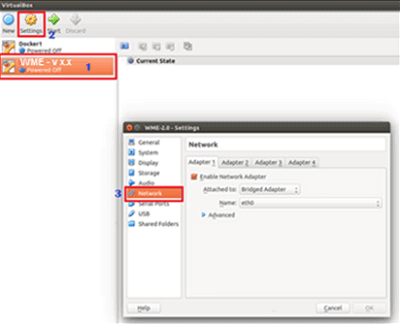

This document talks about  **and Initializing WME** using the WaveMaker Setup Portal. It is recommended that you ensure that you meet the necessary [\-requisites](/learn/installation/wavemaker-enterprise-setup-guide/) before proceeding with the installation.

## WME

You can launch WaveMaker Enterprise using ESXi, VirtualBox, VMware Workstation Pro or AWS EC2 instance.

: You can use the same steps for launching additional VM using the WME External Instance Image if needed.

**      Click on the appropriate section to proceed.**Using ESXi

1.   **vSphere Client** application and login using ESXi Server/vCenter Server  **address** and user credentials.
2. the top left corner of the  **vSphere Client** window, click  and select  **OVF Template** 
3.  the location of the .ova file (for example, WME – x.x.ova) from your local machine and click  (Use the external instance image .ova file name if launching additional VM).
4.   again on the  **OVF Template – OVF Template Details** window. 
5. the  of VM and select the  **Location** and click 
6. the appropriate  from the given list, where the VM Image has to be imported and click 
7. an appropriate destination  for the virtual machine files and click 
8. the appropriate disk option and click 
9. the details and click 

Using Oracle VirtualBox

1.   **VM VirtualBox Manager** Application, on the top left corner of the Oracle VM VirtualBox Manager screen, click  and select  **Appliance** (or use shortcut  **+ I**) from the dropdown options. 
2.  the location of the .ova file (for example, WME – x.x.ova) from your local machine and click   (Use the external instance image .ova file name if launching additional VM).
3. the Application Settings window, after setting the configuration details, check the box adjacent to  **the MAC address of all network cards** and click  
4. will have to wait for a while, till the import gets completed.
5.   and click **\- version x.x** →  →  Make sure the fields  **to** and  options are set to  **Adapter** and **0**, respectively. 

Using VMware Workstation Pro

1.   **Workstation Pro**, click on  **Virtual Machine** and select the WME Platform VM image from your local machine.  (Use the external instance image if launching additional VM). 
2.   on the Import Virtual Machine window.
3. you import the WME VM image, double-click on  and on the right side of the  **Machine Settings** screen, enter the memory as per the required setup type (8000 MB for Trial; 16000 MB for Production use) 
4. click on Processors, on the right side, change the  **of processors** to **1** and  **of cores per processor** to **2** and click  

Using AWS EC2 Instance To launch an AWS EC2 Instance from the WaveMaker AMI, refer to the  [documentation](http://docs.aws.amazon.com/AWSEC2/latest/UserGuide/launching-instance.html) While launching you need to set the following parameters:

1. for the WME AMI ID under Private Images
2. the Instance Type as m3.2xlarge
3. the Network and Subnet to your own VPC network where you wish to launch the EC2 instance
4. the Network Interfaces section of the EC2 Launch Instance wizard, assign a static Primary IP to the eth0 device or via ENI ( [Network Interface](http://docs.aws.amazon.com/AWSEC2/latest/UserGuide/using-eni.html)) to eth1.
5. sure you enable Terminal Protection (recommended)
6. your instance with appropriate Name-Value pairs to help you identify the instance in future (recommended)
7. a Security Group Name and configure the Security Group with the following rules:
    - port 22 (SSH) from your network IP range
    - ports 80 (HTTP), 8080 (HTTP) and 443 (HTTPS) from either your network IP range or from ‘Anywhere’ if you wish to allow public access.
8. a new Key Pair before launching the instance and download this key pair to your machine. Without this file, you won’t be able to login to your instance.

After launching the instance, check that the instance is in the ‘Running’ state and that 2/2 status checks have passed as shown in the screenshot below. 

## WME

You need to initialize WME after launching it.

**      Click on the appropriate section to proceed.**

WME on a VM

importing the VM image through vSphere Client (ESXi) or Oracle VirtualBox or VMware Workstation Pro successfully, you need to launch WaveMaker.

To launch WaveMaker, you need to follow the below steps:

1. the console: From vSphere Client (ESXi)
    
    - vSphere VM Client, left-click on the image in the left panel, below the  **address**
    -   **Console** from the pop-up dialog.
    - on  **On** (green play icon) on the top menu to start the pre-configuration setup.
    
    From Oracle VirtualBox
    
    - importing the image successfully, to open the console, click  on the top menu bar.
    
    From VMware Workstation Pro
    -   **on the Virtual Machine** link, as shown in the screenshot below. 
2. you open the console, you are prompted with WME pre-setup configuration process. Click  (which means “yes”) to continue with the VM Network configuration.
3. the IP range in CIDR notation for internal use by the WME. This should not conflict with the local LAN IP range. Refer the  for details. : IP address representation and its associated routing prefix
4. the ethernet interface name in the VM as **0** or **1** (typically eth0 for VMware or Virtual Box based VMs)
5.   to configure static IP settings or  if you wish to proceed with DHCP configuration. : A network protocol that enables a server to automatically assign an IP address to a device for any given network. : DHCP configuration is not recommended. This option is suggested only for temporary evaluation setups. With DHCP configuration, any change in the network or a restart of the VM or host might change the VM IP and affect the operation of the WaveMaker VM.
6. the static  **address**,  **mask** and  **IP** for the WME VM (eth0).
7. your network’s  **nameserver**(s). : If there are more than one DNS servers, separate it by a 
8. your network  **search** name (if you do not have any, just leave it blank and press ) For example, refer to the screenshot below with sample entries for Steps 1 to 7  : The IPs shown in the screenshots below are sample IPs for illustration purposes only and not the appropriate IPs for your setup. Refer to your IT team to obtain the correct settings for your VM.

Once the WME pre-setup configuration is successfully completed, you will see a success message. You need to access the auto populated URL (:<IP-of-WME-VM>:<port-number>) which needs to be opened in a browser. WME on an AWS EC2 Instance After launching the EC2 instance successfully, you need to login to the instance using the keypair you downloaded.

1. can login to the EC2 Instance using the following command: –i <KEYPAIR\_FILE\_LOCATION> –p <SSH\_PORT> ubuntu@<WM\_EC2\_IP> WM\_EC2\_IP should be the static IP that you assigned to the instance.
2. to the root user using: `/wavemaker:-$ sudo su –`
3. start the WaveMaker Enterprise pre-setup configuration, enter the command: `# wavemaker-initialize`
4. will begin [\-warming your EBS volume](http://docs.aws.amazon.com/AWSEC2/latest/UserGuide/ebs-initialize.html) and the process may take about 30 minutes.
5. the EBS volumes are initialized (pre-warmed), you are prompted with WME pre-setup configuration process. Click Y (which means “yes”) to continue with the Network configuration.
6. an IP range in CIDR notation. This IP range should not be in use anywhere on your VPC network and should not conflict with your LAN IP range. If you are unsure of the range to use, check with IT before accepting defaults. : IP address representation and its associated routing prefix
7. the network interface device name to configure (eth0/eth1). This should be the device to which a static IP was assigned during instance launch.
8. : Ensure to select  configuration by entering  Your instance will automatically acquire the private static IP that was assigned during the Instance Launch phase. : A network protocol that enables a server to automatically assign an IP address to a device for any given network.

Once the WME pre-setup configuration is successfully completed, you will see a success message. You need to access the auto populated URL (:<IP-of-WME-VM>:<port-number>) which needs to be opened in a browser. If the private IP of the instance is not accessible from your browser, you may need to use the public/elastic IP or DNS mapped name instead.

3: Setting up WME

- [1\. Getting Started](/learn/installation/wavemaker-enterprise-setup-guide/)
- [2\. Launching & Initializing WME](#)
    - [Launch using ESXI](#launch-esxi)
    - [Launch using VirtualBox](#launch-vb)
    - [Launch using VMWare](#launch-vmware)
    - [Launch using AWS](#launch-aws)
    - [Initializing WME](#initialize-wme)
    - [Initializing WME on AWS](#initialize-wme-aws)
- [3\. Setting Up WME](/learn/installation/wme-setup-guide-access-setting/)
- [4\. Configuring WME](/learn/installation/wme-setup-guide-configuration/)
- [5\. Adding Capacity](/learn/installation/wme-setup-guide-adding-capacity/)
- [6\. Maintaining WME](/learn/installation/wme-setup-guide-maintenance/)
- [7\. Upgrading WME](/learn/installation/wme-setup-guide-upgrading/)
