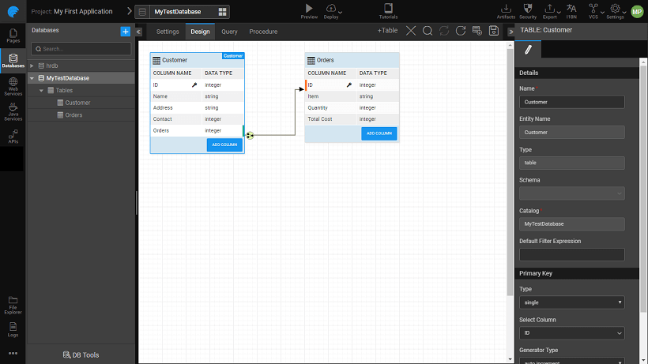
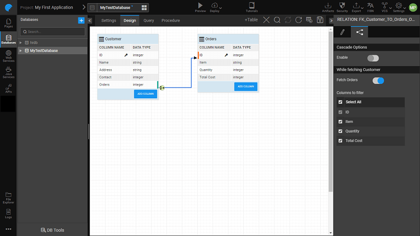
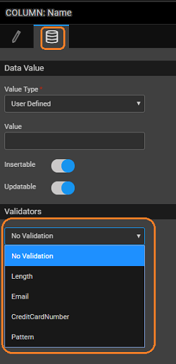

The **Database Designer** workspace allows you to create tables, columns, and relationships.

Click to enlarge

# Adding Tables and Columns

These actions are restricted to [Schemas in Editable mode](/learn/app-development/services/database-services/database-schema-import-modes/).

- Click the **+Table **button to add a new table to the database. You can set the name of the table from the **Properties** **Notes: **
    - WaveMaker requires tables to have primary key value, hence a default column as a primary key is provided. You can change the name or assign another column as primary key, but primary key is a must for all the tables.
    - For tables created, you have the option of assigning it to any Schema which has been imported into the app. This feature is not available for MySQL databases.
- Click **Add Column** to add columns to the table. For each column, you can specify
    - the name of the column,
    - **SQL and Java Types** – It is advisable to make changes to Java Types rather than SQL Types unless you want the changes to be reflected in the database, in which case you need to export the database. You can review the type conversion from Java to SQL type from this document: [Java Types vs SQL Data Types](http://pm.wavemaker.com../assets/JavaTypesVsDBTypes-Sheet.pdf)
    - precision and scale for number type; length for string type;
    - You can also choose to hide the column using **Hidden** option. These columns will not be available for user manipulation. You can set the values of these hidden columns during insert/update operations:
        - by setting the Value from the Data Value tab, or
        - by passing the value during the insert operation from a widget.
    - From the Data tab, set the Value Type as ([click here for more](#column-metadata-configuration)):
        - User Defined which can take a Default Value;
        - Server  Defined in which case the column can be further set to Server Properties and when the Value needs to be set - at Insert, Update or both;
        - Database Defined which uses database trigger or the default values
    - Column level constraints like
        - null
        - primary key
        - unique key
        - foreign key
    - In case of primary key column, the value can be either ([see here for more](#identity-generators))
        - assigned lets user enter the primary key values,
        - auto-generated will assign the primary key values  or
        - sequence will assign the values based on the generator name given. **Note**: WaveMaker supports **Composite Keys** that is multiple columns can be specified as Primary Keys.

# Database Relationships

Relations are a way to establish a connection between tables within a given database. It takes care of the consistency while linking two tables. In WaveMaker, there are two ways of creating **relationships**:

1. Select and hover over the column you want to build a relationship on. Select from _One to One _or _One to Many_ Click the second column of the relationship.
2. For each column, on select and hover, a **Create Relation **icon is also available. Clicking this would open a dialog where
    
    1. the source table and column are already selected and not editable.
    2. select the **cardinality **of the relation:
        - One-to-One Composite relation is possible between the tables which have the same number of composite keys.
        - One-to-Many Composite relation is possible when Table 1 has the composite keys and Table 2 has at least one non-Composite key column selected.
        - Many-to-One Composite relation is possible when Table 1 has at least one non-Composite key column selected and Table 2 has the composite keys.
    3. It is possible to add **Virtual Relations**. This feature can be used to establish relations without changing the DB Schema. This will enable one to enforce DB level constraints without having to write any scripts or queries. Clicking on CREATE will create the virtual relation. This will be indicated by a dotted line and the virtual flag is set in the relationship property.
    4. It is possible to add **Relations involving Composite Keys**. You can **add columns** to the relation by using the **Add Relationship** button. Clicking on CREATE will create the composite relation. This will be indicated by a double-pronged line between the tables in the DB Designer.
    
    

# Relationship Fetch Options

Fetching data from a database table involves retrieving data for all the related tables. This could lead to performance issues, especially when your app does not need all the columns from the related tables. For example, your database contains Employee-Department schema but your app uses just the department name and not the other fields from the Department table. In such cases, you can restrict the data from the related table, Department, while fetching rows from Employee table.

From the relations tab, for the particular relation (one-one, many-one), you can:

1. choose not to fetch the related data, or
2. select the columns from the related table that need to be fetched.

**Notes**:

- Primary Key column from the related table will be fetched.
- By default, all columns from the related table will be fetched.

# Identity Generators for Primary Keys

An identity generator defines the value of the primary key column in database table while inserting new records into it. Identity generators can be defined only for primary key columns. Every database has its own way of defining identity generators that should be mapped while creating a new database table in WaveMaker DB Designer.

WaveMaker presently supports following generator types. These can be accessed from the DB designer from the Properties panel for a Table.

- Auto Increment
- Sequence (only for SQL Server, Oracle, PostgreSQL databases)
- Unique ID (only for SQL Server)
- Assigned

##### Auto ­Increment

An identity generator of type “Auto Increment” automatically sets the value for the column while the record is being inserted, and increments its counter for next insertion. This type is used only for “_integer_” types. Auto-­increment implementation is left to the database. Usually, database implicitly uses sequences for automatically inserting values for such columns. The auto-­increment column in WaveMaker is mapped to the database column as follows:

##### Sequence

Sequences are created in database explicitly. Unlike auto-­increment, the sequence will have its own configuration such as _starts with_, _increment by_ value, and _recycle_ etc. DBA/Developer creates sequences in DB and provides the name of the sequence in the DB Designer for the column. Sequences will be mapped only to _integer_ type columns. When choosing Sequence, an additional option is provided to accept the sequence name. _This is currently supported only for MS SQL server, Oracle, and PostgreSQL_ databases. Sequence information is never directly mapped with a column in the database schema and while reading the database schema, WaveMaker does not associate the table with the sequence name. Hence the application developer has to explicitly map the sequences with the table columns after the DB is imported and perform **Update DB**.

##### Unique ID

Generates a unique identifier based on the MS SQL Server’s NEWID() approach. It generates 128-bit string unique string value. _This is currently supported only for MS SQL server_.

##### Assigned

An identity generator of type “Assigned” will not be managed by the database. The user has to set a value for such column while performing insert operation. This type can be used by columns with any database type.

# Column Metadata Configuration

Data Value Types define the value of column while performing insert/update operations in Database. This is particularly useful for adding auditing of information about the creation and modification of records.

 There are three types of Data Values:

- User Defined
- Server Defined
- Database Defined
- App Environment Defined

##### How it works

These properties are available in the DB designer, at column level under the group **Data Value**. The Value Type field enables you to select one of the types mentioned above. The definition & configuration of each type is defined in below sections. After choosing the data value types, the developer has to invoke **Update DB** to get the changes reflected. NOTE: Changes to Data Value types will not alter the underlying schema, however, the Java code will get regenerated on Update DB.

##### User Defined

This is the default behavior. In this case, the value provided by the end-user will be persisted while performing insert/update operations. The Default value when set will be used if you do not provide a value for that column. Validations can be enforced by setting Validators for the User defined columns. [More on validators](#validators).

##### Server Defined

In this mode, the value provided by the end-user will not be honored. It will be replaced with the server defined property that is configured. This column will not be shown in Live Form or in the Live Variables Data tab. Based upon the column data type, the following are the server defined properties available:

- For string data type:
    - Logged-in User Id (also for integer data type)
    - Logged-in User Name
- for date data type:
    - Current Date
    - Current Time
    - Current Date & Time

##### Database Defined

In Database Defined mode, the application will never send any value for this column while performing insert/update operations. It is left to the database to set a value post insert/update operations. Developers can write database trigger or use database default values to set the column values. If there is no database default and the column does not accept null values, then the insert/update operation might fail. This column will not be shown in Live Form or in the Live Variables Data tab.

##### App environment Defined

App environment properties are custom server side properties defined by the app developer to externalize certain properties into configuration profiles, so that those property values can differ for different environment. The app environment properties can be defined from the config profile dialog ([know more](/learn/how-tos/using-app-environment-properties/)).

## MetaData Value Settings

The Data Value specified for each column can be set either at the time of row creation and/or updating. For every database operation such as create/update of a record for a table, the insert/update statements include each and every column of the table in the respective query. There might be cases where the insert/update may not pass values for some columns to the database and thus leaving the decision to the database for insert or update value for the respective columns. _For example:_ Consider a table with columns for date of creation and date of modification. The date of creation needs to be entered only once at the time of record creation, subsequent updates to that row should not change its value. Whereas, the date of modification will be set to null at the time of row creation but updated everytime the row values are updated.

To support such cases where you want to control whether to include a particular column value in the insert/update statement, WaveMaker has **Insertable** and **Updatable** options for table columns in the _Database Designer_. In the above example, the insertable option will be set to true for the date of creation column and the updatable option will be set for the date of modification column.

- **Insertable**: If the insertable option is selected, then the values will be passed at the time of new record creation. If only the insertable option is selected (updatable option unchecked) the value will be passed to the database during insert. The value will not be changed for that column during the update. If the _insertable option is not selected_, then the value of the column during the creation of a new record will be based on the following scenarios:
    
    - If a default value is configured in the database then the default value is inserted.
    - If a default value is not configured in the database and the column is nullable, then the value will be set to null.
    - If there are any triggers written for that column, those values are considered while inserting data into that column.
    
    _Example_: Considering hrdb sample database. Let's say you want to assign default ROLE or NULL while creating new USER. To achieve this un-select the insertable option for ROLE column in the USER table. _Generated Code_: In _User.java_ that column’s insertable property marked as false
    
       @Column(name = "\`ROLE\`", nullable = true, insertable = false, length = 20)
        public String getRole() {
            return this.role;
        }
    
    Insert SQL: ROLE column was ignored in the insert script so that the value will be assigned with configured default value or NULL.
    
    insert into PUBLIC."USER" ("USER\_ID", "PASSWORD", "TENANT\_ID", "USERNAME") values (default, ?, ?, ?)
    
- **Updatable**: If the updatable option is selected, then the values will be passed at the time of updating the record in the database. If updatable option alone is selected (insertable option unchecked) the value will be passed to the database during an update. The value will not be passed for that column during insert. If the _updatable option is not selected_, then the value of the column during the update of the record, will be based on the following rules:
    
    - The value passed to the column during insert doesn’t change
    - If there are any triggers written for that column, those values are considered while inserting data into that column
    
    _Example_: Considering hrdb sample database. Let's say you don’t want to change the USERNAME column while updating USER table. So to do that we have to un-select the updatable option for USERNAME column in the USER table. _Generated Code_: In _User.java_ that column’s updatable property marked as false
    
       @Column(name = "\`USERNAME\`", nullable = true, updatable = false, length = 20)
        public String getUsername() {
            return this.username;
        }
    
    Update SQL: USERNAME column was ignored in update script.
    
    update PUBLIC."USER" set "PASSWORD"=?, "ROLE"=?, "TENANT\_ID"=? where "USER\_ID"=?
    

## Data Validators

There may be situations where you might want to set validations for user-defined columns. This can be achieved by an option to select the validation from the list of default validators list for the column based on the data type. This option is available on the properties panel for the selected column.

| Validator | Column Data Type | Description | Values |
| --- | --- | --- | --- |
| Length | String | It defines the number (minimum and maximum) of input characters that are allowed for the column. | It expects two integer values:
- Min
- Max

 |
| Email | String | If email validator is given, the value given to that column tested for default email pattern. You can enhance the validation by specifying a regular expression, for example, allow emails for a specific domain. | RegExp: optional |
| Credit Cart Number | String | This column expects 16 digits numeric number. Basic mod 10 checksum validation is performed. |  |
| Pattern | String | It checks for the particular pattern present in that column value else throws a validation error. | RegExp |
| AssertTrue | Boolean | The value of that column must be provided as true. |  |
| AssertFalse | Boolean | The value of that column must be provided as false. |  |
| Min | Byte, Integer, Long, Short, BigInteger | The minimum value allowed. |  |
| Max | Byte, Integer, Long, Short, BigInteger | The maximum value allowed. |  |
| Range | Byte, Integer, Long, Short, BigInteger | The value of the column should be between a minimum and maximum values. | It expects two integer values:

- Min
- Max

 |
| DecimalMin | Double, BigDecimal | The minimum value allowed. |  |
| DecimalMax | Double, BigDecimal | The maximum value allowed. |  |
| DecimalRange | Double, BigDecimal | The value of the column should be between a minimum and maximum values. | It expects two integer values:

- Min
- Max

 |
| Future |  Date, Time, Timestamp | The value in this column should be ahead of current (runtime) date/time/timestamp |  |
| Past |  Date, Time, Timestamp | The value in this column should be behind current (runtime) date/time/timestamp |  |

## Implementation in WaveMaker

The _Insertable_ and _Updatable_ options can be configured for **User Defined** and **Server Defined** value types for Database columns. For **Database Defined** value type these are implicitly set to false. **Insertable** and **Updatable** options are provided under _Data Value_ group for the columns in the **Database Designer**. 

- If the Value Type is selected as _User Defined or Server Defined_, both Insertable and Updatable options are selected by default. You can edit the options, but **at least one option** has to be selected.
    - If you select _Insertable option alone_, the column value will be inserted only at the time of creating a new record. The inserted value will not be updated at any point of time if the Updatable option is unchecked.
    - If you select the _Updatable option alone_, the column value will be set to the default value if provided or null at the time of creation and will be updated subsequently.
- If the Value Type is selected as _Database Defined_, by default both the options are deselected and disabled. That is, the column acts as a read-only column.

## Virtual Primary Keys and Relationships

#### Virtual Primary Keys

In case you are using a database table which has no primary keys and either you do not have the access to change the DB design or do not want to change the original database design, you can still use it in your WaveMaker apps despite Hibernate constraints. You can designate one or more columns as a Virtual Primary Key. This will be used within the WaveMaker to enforce integrity constraints without having to change the database. The original database schema remains untouched, even after Update DB. This will ensure that the APIs are clear and you can perform CRUD operations on your existing database views as well.

Designation of Virtual Primary Key can be done at the time of Database Import or later from the Table Properties.

### Limitations of using virtual primary key

- Since the external database is not updated with the virtual key, the data in the table may have duplicates if any external app is also using the same table for CRUD operations.
- Though CRUD operations are possible in views having virtual primary keys, the database may have its own limitations to support the same. (esp when the view is joined with multiple tables)

### Recommendations

This feature should be used with existing databases only, we would not recommend creating a table with no or virtual primary key.

### Virtual Relationships

Similar to Primary Keys, there might arise a situation where you want to enforce referential integrity in your app where none exist in the database. In such cases, Virtual Relations are of help. This feature can be used to establish relations without changing the DB Schema. This will enable you to enforce database level constraints without having to write any scripts or queries.

< Data Modelling

Temporal Support >

DB Access >

5\. Creating Backend Services

- 5.1 Overview
    - [i. Accessing Data](/learn/app-development/services/creating-backend-services/#accessing-data)
        - [○ Life-cycle of data](/learn/app-development/services/creating-backend-services/#life-cycle)
    - [ii. Manipulating Data](/learn/app-development/services/creating-backend-services/#manipulating-data)
        - [○ Life-cycle of Events](/learn/app-development/services/creating-backend-services/#life-cycle-events)
    - [iii. REST APIs](/learn/app-development/services/creating-backend-services/#rest-apis)
- 5.2 Web Services
    - [i. Overview](/learn/services/web-services/web-services/#overview)
    - [ii. Variables for Invocation](/learn/services/web-services/web-services/#service-variable)
    - iii. Working with SOAP Services
        - [○ Overview](/learn/app-development/services/web-services/web-services/working-with-soap-services/#SOAP-service-setup)
        - [○ SOAP Service Setup](/learn/app-development/services/web-services/working-with-soap-services/#SOAP-service-setup)
        - [○ SOAP Service Settings](/learn/app-development/services/web-services/working-with-soap-services/#SOAP-service-settings)
        - [○ Generated REST APIs](/learn/app-development/services/web-services/working-with-soap-services/#generated-rest-apis)
        - [○ SOAP Service Usage](/learn/app-development/services/web-services/working-with-soap-services/#SOAP-service-usage)
    - iv. Working with REST Services
        - [○ Overview](/learn/app-development/services/web-services/rest-services/)
        - [○ Test REST Service](/learn/app-development/services/web-services/rest-services/#test-API)
        - [○ Configure REST Service](/learn/app-development/services/web-services/rest-services/#configure-REST-service)
        - [○ REST Service Usage](/learn/app-development/services/web-services/rest-services/#REST-service-usage)
    - iii. Working with Web Sockets
        - [○ Overview](/learn/app-development/services/web-services/working-with-websockets/)
        - [○ Service Integration](/learn/app-development/services/web-services/working-with-websockets/#import)
        - [○ Service Consumption](/learn/app-development/services/web-services/working-with-websockets/#variable)
        - [○ Use Cases](/learn/app-development/services/web-services/working-with-websockets/#use-cases)
- 5.3 Model Designer
    - [i. Overview](/learn/app-development/services/model-designer/)
- [5.4 Database Services](/learn/app-development/services/database-services/database-services/)
    - [i. Overview](/learn/app-development/services/database-services/database-services/#)
    - [ii. Supported Databases](/learn/app-development/services/database-services/database-services/#supported-databases)
    - iii. Working with Databases
        - [○ Overview](/learn/app-development/services/database-services/working-with-databases/#)
        - [○ Adding Database](/learn/app-development/services/database-services/working-with-databases/#integrating-database)
        - [○ Database Actions](/learn/app-development/services/database-services/working-with-databases/#database-actions)
    - [iv. Data Modelling](/learn/app-development/services/database-services/data-modelling/)
        - [○ Overview](/learn/app-development/services/database-services/data-modelling/)
        - [○ Configuration Settings](/learn/app-development/services/database-services/data-modelling/#configuration-settings)
        - [○ Database Designer](/learn/app-development/services/database-services/data-modelling/#database-designer)
            - [● Schema Import Modes](/learn/app-development/services/database-services/database-schema-import-modes/)
        - [○ Working with Database Schema](#)
            - [● Overview](#)
            - [● Adding Tables and Columns](#add-tables-columns)
            - [● Working with Relationships](#database-relationships)
            - [● Identity Generators for Primary Key Column](#identity-generators)
            - [● Column Metadata Configuration](#column-metadata-configuration)
            - [● User-defined Column Data Validators](#validators)
            - [● Virtual Primary Keys and Relations](#virtual-primary-keys)
            - [● Temporal Support](/learn/app-development/services/database-services/temporal-support/)
    - v. Databases Access
        - [○ Overview](/learn/app-development/services/database-access/)
        - ○ Working with Queries
            - [● Overview](/learn/app-development/services/database-services/working-with-queries/)
            - [● Query Editor](/learn/app-development/services/database-services/working-with-queries/#query-editor)
            - [● Types of Queries](/learn/app-development/services/database-services/working-with-queries/#query-types)
            - [● Query Creation](/learn/app-development/services/database-services/working-with-queries/#query-creation)
            - [● Query Usage](/learn/app-development/services/database-services/working-with-queries/#query-usage)
            - [● Parameterised Query Creation](/learn/app-development/services/database-services/working-with-queries/#query-creation-parameterised)
            - [● Query Operation Type](/learn/app-development/services/database-services/working-with-queries/#query-op-types)
            - [● Query Architecture](/learn/app-development/services/database-services/working-with-queries/#query-architecture)
        - ○ Working with Stored Procedures
            - [● Overview](/learn/app-development/services/db-services/working-stored-procedures/)
            - [● Procedure Creation](/learn/app-development/services/db-services/working-stored-procedures/#procedure-creation)
            - [● Procedure Parameters](/learn/app-development/services/db-services/working-stored-procedures/#proc-params)
            - [● Procedure Invocation](/learn/app-development/services/db-services/working-stored-procedures/#procedure-invocation)
            - [● Procedure Architecture](/learn/app-development/services/db-services/working-stored-procedures/#procedure-architecture)
        - [○ Versioning of Queries and Procedures](/learn/app-development/services/database-services/versioning-queries-procedures/)
        - [○ Blob Support for Queries and Procedures](/learn/app-development/services/database-services/blob-support-queries-procedures/)
        - [○ Invoking Queries & Procedures from Java Service](/learn/app-development/services/database-services/invoking-queriesprocedures-java-services/)
        - [○ Database Views](/learn/app-development/services/db-services/database-views/)
        - ○ Database Tools
            - [● Overview](/learn/app-development/services/database-tools/)
            - [● DB Shell](/learn/app-development/services/database-tools/#db-shell)
            - [● DB Scripts](/learn/app-development/services/database-tools/#db-scripts)
                - [● Import DB](/learn/app-development/services/database-tools/#import-db)
                - [● Export DB](/learn/app-development/services/database-tools/#export-db)
    - vi. ORM Artifacts
        - [○ Database Integration Process](/learn/app-development/services/db-services/orm-artifacts/#database-integration-process)
        - [○ Layered Architecture](/learn/app-development/services/db-services/orm-artifacts/#layered-architecture)
        - [○ Generated Files](/learn/app-development/services/db-services/orm-artifacts/#generated-files)
        - [○ Generated APIs](/learn/app-development/services/db-services/orm-artifacts/#generated-apis)
            - [● CRUD APIs](/learn/app-development/services/db-services/orm-artifacts/#crud-apis)
            - [● Query APIs](/learn/app-development/services/db-services/orm-artifacts/#query-apis)
            - [● Custom Query Syntax](/learn/app-development/services/db-services/orm-artifacts/#custom-query-syntax)
- 5.6 API Designer
    - [i. Overview](/learn/app-development/services/api-designer/api/)
    - [ii. Database Services APIs](/learn/app-development/services/api-designer/database-service-apis/)
    - [iii. Web Services APIs](/learn/app-development/services/api-designer/web-service-apis/)
    - [iv. Java Services APIs](/learn/app-development/services/api-designer/java-service-apis/)
    - [v. Security Services APIs](/learn/app-development/services/api-designer/security-service-apis/)
- 5.7 3rd Party Libraries
    - [i. Overview](/learn/app-development/services/3rd-party-libraries/)
    - [ii. Including resource files](/learn/app-development/services/3rd-party-libraries/#resource-files)
    - [iii. Using third-party JavaScript file](/learn/app-development/services/3rd-party-libraries/using-3rd-party-javascript-files/)
    - [iv. Using third-party jar file](/learn/app-development/services/3rd-party-libraries/using-3rd-party-jar-files/)
