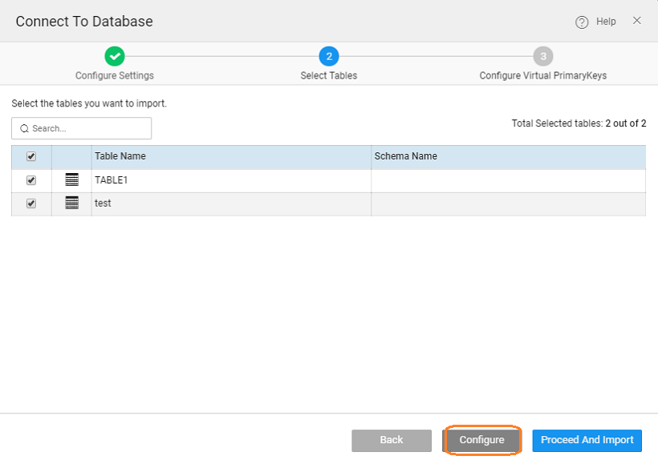

## Adding Database

**Databases** can be accessed from the Resource Menu. Clicking the **+** will allow you to add a database to your app.

There are various ways of adding a database into your app:

1. **Connect to a DB**: Using this option you can add an external database (supported databases as per the list above). You can import the database as Read-Only or as Editable. [Know more about Schema Import Modes](/learn/app-development/services/database-services/database-schema-import-modes/). For user convenience, WaveMaker gives you the option of:
    - hosting a **MariaDB** database on WaveMaker Cloud,
    - using a **Sample DB**. You can import this database into your app and try various scenarios, it is a great place to get started on DB services. This is an HSQL database _hrdb,_ with four tables:
        - _Department_ table with deptid, name, code, location and budget figures;
        - _Employee_ table with employee details like id, name, address, picture, date of birth, job title, department id (foreign key), manager id (self-referential key) and username password;
        - _Vacation_ table giving the vacation details like start date, end date, leave status and type, and related to Employee table via empid;
        - _User_ table with name, password and role information.
    - Connect to an external database meeting the [WaveMaker requirements](/learn/app-development/services/database-services/database-services/#supported-databases).
2. **Upload MySQL files** option lets you create a database by importing a DB Script. This option is available for hosting the database on WaveMaker Cloud.
3. You can **Create** your own database using the database designer. Using this option you can create MySQL, PostgreSQL, or SQL Server database and host them on WaveMaker Cloud (for MariaDB) or your external database.

## Configuring Virtual Primary Key

##### 10.0 release

When connecting to an external Database, if the tables do not have Primary Key, you will be given an option to assign a Virtual Primary Key. It is strongly recommended that you assign Virtual Primary Key to avoid any runtime issues.

While connecting or importing the Database, select the Configure option to assign Virtual Primary Key  You can select column or columns whose values are unique and assign them to be the Virtual Primary Key. This assignment is specific to the app and will not impact the Database. Note: Post import you can always assign Virtual Primary key from the Database Designer Table properties. [Click here for how](/learn/app-development/services/database-services/working-database-schema/#virtual-primary-keys).

## Map Sequences

For databases that support sequences (Oracle, SQL Server, PostgreSQL, DB2, etc.) for the Primary Key generation, the mapping of Primary Key columns to the respective Sequences can be done at the time of connecting to Database.

You also have the option to change the assigned type to sequence and then assign a sequence to the same.

## Database Actions

Once you have your app integrated with a database, a copy is created in your local project workspace. While you can access the data through Variables, any changes made to the database at the schema level to the local database or external database has to be synced with its counterpart. The various ways to achieve this are:

Action

Description

**Re-Import Database** will rewrite the db in your workspace with the actual db thus reverting any changes. It deletes the draft and generates the data model with given database details.

**Export Database** will update the db with the changes from your workspace ie the draft database.

**Save Database** will save the db in your app workspace, this is the draft copy of the database solely available to your app.

**Update Database** will update the db with the changes from your workspace and incorporate changes made by any other collaborator (provided they have exported the changes). This option is available after you make changes to the database schema from the design tab of the database designer.

**Revert Database** will revert the db and delete the changes from your workspace. This option is available after you make changes to the database schema from the design tab of the database designer.

## Advanced Settings (only for External Databases)

Apart from the basic Database settings like host details, schema name etc., **advanced database configuration options** need to be provided, when using an External Database. Based upon the basic settings the Advanced Settings are auto-populated but can be modified. Each Database System provides different options so you will see a portion of the options listed below, tailored to the Database System you are using.

**Note**: For connecting to an external database, you need to **Test Connection** before proceeding.

Setting

Description

**Service Name**

Name used to reference the imported database. By default, this is same as the Database Name, defined in Database Info section (not available for HSQL and MariaDB).

**Port**

The port number for the database. Typically this is set automatically when the database type is selected and should not be changed (not available for HSQL and MariaDB).

**Connection URL**

When you import a database using the standard configuration options on the Import Database screen, WaveMaker creates a JDBC URL for you. This URL is shown here in the Connection URL field. These are usually specific to the database type. For example with MySQL some character set usage could require adding “?useUnicode=true&characterEncoding=UTF-8” to the URL to characters to display correctly. If you know what you are doing and want to change this JDBC URL, you can do it here.

**Java Package**

WaveMaker generates Java classes for you when you import a database. If you want a different Java package name than the default name we generate, type it in here.

**Table Filter**

By default WaveMaker imports all the tables in the database. If you want to import only a subset of the tables, type in a comma-delimited list of regular expressions here (not available for HSQL and MariaDB).

**Schema Filter**

When you are importing a database that supports schemas, WaveMaker imports only the tables for the default schema. If you want to import tables from other schemas, add the schema names in this field.

**Driver Class**

JDBC driver class name. WaveMaker creates a JAR file for each database that uses a specified driver. If you want to use a different JAR file for connecting, specify it here (the JAR file must be in the Application Server’s classpath).

**Dialect**

Hibernate dialect. See Hibernate documentation for details, including the list of available dialects.

**Naming Strategy**

Most users should leave this blank. Enter the name of a Java class you created for handling the naming strategy (not available for HSQL and MariaDB)

< Databases Services

Data Modelling >

5\. Creating Backend Services

- 5.1 Overview
    - [i. Accessing Data](/learn/app-development/services/creating-backend-services/#accessing-data)
        - [○ Life-cycle of data](/learn/app-development/services/creating-backend-services/#life-cycle)
    - [ii. Manipulating Data](/learn/app-development/services/creating-backend-services/#manipulating-data)
        - [○ Life-cycle of Events](/learn/app-development/services/creating-backend-services/#life-cycle-events)
    - [iii. REST APIs](/learn/app-development/services/creating-backend-services/#rest-apis)
- 5.2 Web Services
    - [i. Overview](/learn/services/web-services/web-services/#overview)
    - [ii. Variables for Invocation](/learn/services/web-services/web-services/#service-variable)
    - iii. Working with SOAP Services
        - [○ Overview](/learn/app-development/services/web-services/web-services/working-with-soap-services/#SOAP-service-setup)
        - [○ SOAP Service Setup](/learn/app-development/services/web-services/working-with-soap-services/#SOAP-service-setup)
        - [○ SOAP Service Settings](/learn/app-development/services/web-services/working-with-soap-services/#SOAP-service-settings)
        - [○ Generated REST APIs](/learn/app-development/services/web-services/working-with-soap-services/#generated-rest-apis)
        - [○ SOAP Service Usage](/learn/app-development/services/web-services/working-with-soap-services/#SOAP-service-usage)
    - iv. Working with REST Services
        - [○ Overview](/learn/app-development/services/web-services/rest-services/)
        - [○ Test REST Service](/learn/app-development/services/web-services/rest-services/#test-API)
        - [○ Configure REST Service](/learn/app-development/services/web-services/rest-services/#configure-REST-service)
        - [○ REST Service Usage](/learn/app-development/services/web-services/rest-services/#REST-service-usage)
    - iii. Working with Web Sockets
        - [○ Overview](/learn/app-development/services/web-services/working-with-websockets/)
        - [○ Service Integration](/learn/app-development/services/web-services/working-with-websockets/#import)
        - [○ Service Consumption](/learn/app-development/services/web-services/working-with-websockets/#variable)
        - [○ Use Cases](/learn/app-development/services/web-services/working-with-websockets/#use-cases)
- [5.3 Database Services](/learn/app-development/services/database-services/database-services/)
    - [i. Overview](/learn/app-development/services/database-services/database-services/#)
    - [ii. Supported Databases](/learn/app-development/services/database-services/database-services/#supported-databases)
    - [iii. Working with Databases](#)
        - [○ Overview](#)
        - [○ Adding Database](#integrating-database)
        - [○ Map Sequences](#map-sequences)
        - [○ Database Actions](#database-actions)
        - [○ Advanced Settings](#advanced-settings)
    - iv. Data Modelling
        - [○ Overview](/learn/app-development/services/database-services/data-modelling/)
        - [○ Configuration Settings](/learn/services/db-services/data-modelling/#configuration-settings)
        - [○ Database Designer](/learn/services/db-services/data-modelling/#database-designer)
            - [● Schema Import Modes](/learn/app-development/services/database-services/database-schema-import-modes/)
        - ○ Working with Database Schema
            - [● Overview](/learn/app-development/services/database-services/working-database-schema/)
            - [● Adding Tables and Columns](/learn/app-development/services/database-services/working-database-schema/#add-tables-columns)
            - [● Working with Relationships](/learn/app-development/services/database-services/working-database-schema/#database-relationships)
            - [● Identity Generators for Primary Key Column](/learn/app-development/services/database-services/working-database-schema/#identity-generators)
            - [● Column Metadata Configuration](/learn/app-development/services/database-services/working-database-schema/#column-metadata-configuration)
            - [● Virtual Primary Keys and Relations](/learn/app-development/services/database-services/working-database-schema/#virtual-primary-keys)
    - v. Databases Access
        - [○ Overview](/learn/app-development/services/database-access/)
        - ○ Working with Queries
            - [● Overview](/learn/app-development/services/database-services/working-with-queries/)
            - [● Query Editor](/learn/app-development/services/database-services/working-with-queries/#query-editor)
            - [● Types of Queries](/learn/app-development/services/database-services/working-with-queries/#query-types)
            - [● Query Creation](/learn/app-development/services/database-services/working-with-queries/#query-creation)
            - [● Query Usage](/learn/app-development/services/database-services/working-with-queries/#query-usage)
            - [● Parameterised Query Creation](/learn/app-development/services/database-services/working-with-queries/#query-creation-parameterised)
            - [● Query Operation Type](/learn/app-development/services/database-services/working-with-queries/#query-op-types)
            - [● Query Architecture](/learn/app-development/services/database-services/working-with-queries/#query-architecture)
        - ○ Working with Stored Procedures
            - [● Overview](/learn/app-development/services/db-services/working-stored-procedures/)
            - [● Procedure Creation](/learn/app-development/services/db-services/working-stored-procedures/#procedure-creation)
            - [● Procedure Parameters](/learn/app-development/services/db-services/working-stored-procedures/#proc-params)
            - [● Procedure Invocation](/learn/app-development/services/db-services/working-stored-procedures/#procedure-invocation)
            - [● Procedure Architecture](/learn/app-development/services/db-services/working-stored-procedures/#procedure-architecture)
        - [○ Versioning of Queries and Procedures](/learn/app-development/services/database-services/versioning-queries-procedures/)
        - [○ Blob Support for Queries and Procedures](/learn/app-development/services/database-services/blob-support-queries-procedures/)
        - [○ Invoking Queries & Procedures from Java Service](/learn/app-development/services/database-services/invoking-queriesprocedures-java-services/)
        - [○ Database Views](/learn/app-development/services/db-services/database-views/)
        - ○ Database Tools
            - [● Overview](/learn/app-development/services/database-tools/)
            - [● DB Shell](/learn/app-development/services/database-tools/#db-shell)
            - [● DB Scripts](/learn/app-development/services/database-tools/#db-scripts)
                - [● Import DB](/learn/app-development/services/database-tools/#import-db)
                - [● Export DB](/learn/app-development/services/database-tools/#export-db)
    - vi. ORM Artifacts
        - [○ Database Integration Process](/learn/app-development/services/db-services/orm-artifacts/#database-integration-process)
        - [○ Layered Architecture](/learn/app-development/services/db-services/orm-artifacts/#layered-architecture)
        - [○ Generated Files](/learn/app-development/services/db-services/orm-artifacts/#generated-files)
        - [○ Generated APIs](/learn/app-development/services/db-services/orm-artifacts/#generated-apis)
            - [● CRUD APIs](/learn/app-development/services/db-services/orm-artifacts/#crud-apis)
            - [● Query APIs](/learn/app-development/services/db-services/orm-artifacts/#query-apis)
            - [● Custom Query Syntax](/learn/app-development/services/db-services/orm-artifacts/#custom-query-syntax)
- 5.4 Java Services
    - [i. Overview](/learn/app-development/services/java-services/java-service/#overview)
    - [ii. Java Services Framework](/learn/app-development/services/java-services/java-service/#java-services-framework)
    - iii. Integration Services
        - [○ Current Loggedin User](/learn/app-development/services/java-services/java-integration-services/#loggedin-user)
        - [○ External Java Libraries](/learn/app-development/services/java-services/java-integration-services/#external-java-libraries)
        - [○ Database Entities](/learn/app-development/services/java-services/java-integration-services/#db-services)
        - [○ Named Queries](/learn/app-development/services/java-services/java-integration-services/#query-service)
        - [○ Imported Web Services](/learn/app-development/services/java-services/java-integration-services/#web-services)
    - [iv. Service Variables](/learn/app-development/services/java-services/service-variables/)
    - [v. Generated REST APIs](/learn/app-development/services/java-services/generated-rest-apis-api-designer/)
- 5.5 API Designer
    - [i. Overview](/learn/app-development/services/api-designer/api/)
    - [ii. Database Services APIs](/learn/app-development/services/api-designer/database-service-apis/)
    - [iii. Web Services APIs](/learn/app-development/services/api-designer/web-service-apis/)
    - [iv. Java Services APIs](/learn/app-development/services/api-designer/java-service-apis/)
    - [v. Security Services APIs](/learn/app-development/services/api-designer/security-service-apis/)
- 5.6 3rd Party Libraries
    - [i. Overview](/learn/app-development/services/3rd-party-libraries/)
    - [ii. Including resource files](/learn/app-development/services/3rd-party-libraries/#resource-files)
    - [iii. Using third-party JavaScript file](/learn/app-development/services/3rd-party-libraries/using-3rd-party-javascript-files/)
    - [iv. Using third-party jar file](/learn/app-development/services/3rd-party-libraries/using-3rd-party-jar-files/)
