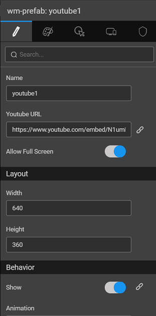

prefab ships with WaveMaker and it connects with Youtube to display a video on the web page.

1. and drop the prefab onto the canvas on any of the pages of your application.
2. the , and **URL** properties of the prefab using the **Panel**
3. and the project. You will see that the video is now embedded on the page in a container with specified height and width.

 

[9\. Custom Widgets - Prefabs](/learn/app-development/widgets/widget-library/#prefabs)

- [9.1 Youtube](/learn/app-development/widgets/prefab/youtube/)
- [9.2 Googlemaps](/learn/app-development/widgets/prefab/googlemaps/)
- [9.3 QRCode](/learn/app-development/widgets/prefab/qrcode/)
- [9.4 OAuth Prefabs](/learn/app-development/widgets/prefab/oauth-prefabs/)
    - [9.4.1 Box](/learn/app-development/widgets/prefab/oauth-prefabs/box/)
    - [9.4.2 Facebook](/learn/app-development/widgets/prefab/oauth-prefabs/facebook/)
    - [9.4.3 Google](/learn/app-development/widgets/prefab/oauth-prefabs/google/)
    - [9.4.4 Instagram](learn/app-development/widgets/prefab/oauth-prefabs/instagram/)
    - [9.4.5 LinkedIn](/learn/app-development/widgets/prefab/oauth-prefabs/linkedin/)
