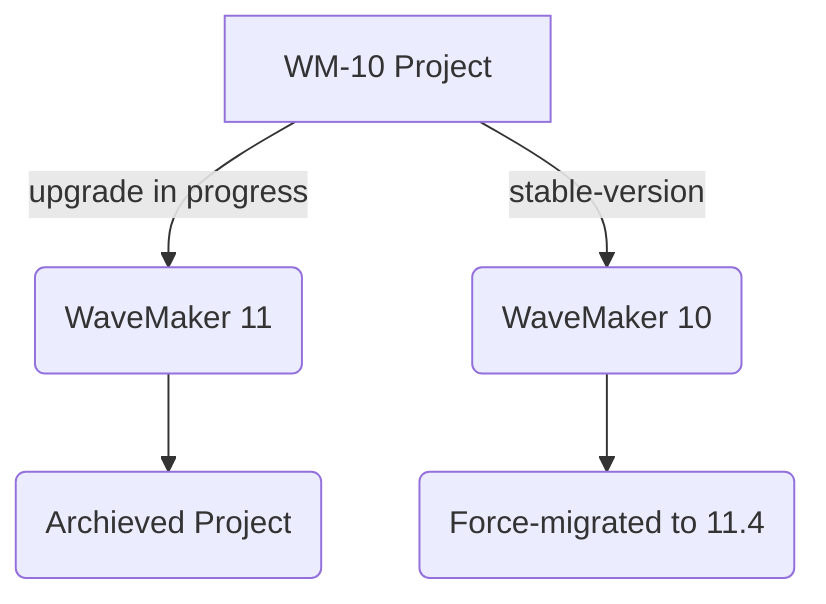

---

WaveMaker strives to provide the best possible experience to all our users by regularly enhancing and upgrading our products. With this in mind, we are excited to announce the upcoming release of WaveMaker Version 11.4, which will introduce various new features and improvements, such as React Native features, tightly-coupled team collaboration, and reimport of backend APIs, and more exciting features. 

See what’s in [WaveMaker 11](https://docs.wavemaker.com/learn/app-development/wavemaker-overview/wavemaker-11)

## Ending Support to WaveMaker 10 Projects

However, with the release of Version 11.4, we will officially discontinue support for WaveMaker Version 10 projects. This decision is aligned with our commitment to delivering the latest technology and ensuring that our users can benefit from the most up-to-date and secure features. As part of this transition, support for WaveMaker 10.x projects will cease by September 4, 2023.

## What Should You Do?

After the 11.4 release, our technical support team will no longer provide assistance or updates for projects running on Version 10. Therefore, we strongly recommend that you plan to migrate your projects to the latest version to continue receiving support and leverage the latest functionalities.

### Migrating from WaveMaker 10.x to 11.x

:::warning
If you do not migrate your projects to 11.x, your projects will automatically be migrated to the latest related version i.e. 11.4.x. We recommend you initiate the upgrade to take control of your projects and plan accordingly. For more information, see our latest releases information. 
:::

To aid you in the process of migration, we have prepared detailed documentation on migrating from Version 10 to the latest Version 11.x. To get started with the migration process, see [Updating an App from WaveMaker 10 WaveMaker 11](https://docs.wavemaker.com/learn/how-tos/upgrade-guide-wavemaker-10-to-11).

### Upgrade In-progress: Archived Apps

It is recommended to complete the migration from WaveMaker 10 to WaveMaker 11.x before the 11.4 release, in case you do not update the project before the planned migration date of 11.4, two things will happen:

1. WaveMaker 10 projects that have not been migrated will be force-migrated to 11.4.
2. WaveMaker 11 Migration in-progress projects will be moved to the Archived apps.

