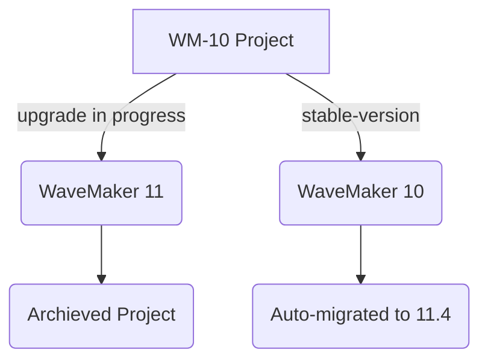

---

We are excited to announce the upcoming release of WaveMaker Version 11.4, which will introduce various new features and improvements. With this release, we end our support for WaveMaker 10 projects. 

Upon launching WaveMaker 11.0 on June 6th, 2022, our users were provided with the flexibility to work on WaveMaker 10 projects while undertaking the upgrade process to WaveMaker 11, using our [Multi-version Studio](https://docs.wavemaker.com/learn/app-development/wavemaker-overview/faqs-11/#what-is-multi-version-studio). With 11.4 release, we are disabling the support for the above facility and auto-upgrading the projects to WaveMaker 11. 

<!-- truncate -->

## What will happen?

However, with the release of Version 11.4, we will officially discontinue support for WaveMaker Version 10 projects. This decision is aligned with our commitment to delivering the latest technology and ensuring that our users can benefit from the most up-to-date and secure features. As part of this transition, we will be ending support for WaveMaker 10.x projects by September 4, 2023.

:::note

Once the 11.4 release is deployed on [wavemakeronline.com](https://www.wavemakeronline.com/studio/#/projects), WaveMaker 10 projects will undergo an automatic upgrade to 11.4.

:::

## What Should You Do?

After the 11.4 release, our support team will no longer provide assistance or updates for projects running on Version 10. Therefore, we strongly recommend that you plan to migrate your projects to the latest version to continue receiving support and leverage the latest functionalities.

### Migrating from WaveMaker 10.x to 11.x

:::important

If you do not migrate your projects to 11.x, your projects will automatically be migrated to the latest released version i.e. 11.4.x. We recommend you initiate the upgrade to take full control of your project migration and plan it accordingly. For more information, see the release information.

:::

To aid you in the process of migration, we have prepared detailed documentation on migrating from Version 10 to the latest Version 11.x. To get started with the migration process, see [Updating an App from WaveMaker 10 WaveMaker 11](https://docs.wavemaker.com/learn/how-tos/upgrade-guide-wavemaker-10-to-11).

### Upgrade In-progress: Archived Apps

It is recommended to complete the migration from WaveMaker 10 to WaveMaker 11.x before the 11.4 release. To perform smooth migration, WaveMaker has provided the ability to use the multi-studio projects, this enables you to initiate migration and continue working on WaveMaker 10 projects while you simultaneously implement WaveMaker 11 upgrade. In the process of migration,

#### WaveMaker 10 projects 
  
WaveMaker 10 projects that have not been migrated will be automatically migrated to 11.4. Users might face some issues as it is migrated without their interference. 

#### WaveMaker 11 Projects

For the WaveMaker 10 projects for which the migration process has been initiated, WaveMaker 11 version will be moved to the Archived apps, and the WaveMaker 10 version of the project will be auto-migrated to WaveMaker 11.4.

To avoid auto-migration from WaveMaker 10 to WaveMaker 11, complete the process before 4th September 2023. In case of any assistance, reach out to our support team.

