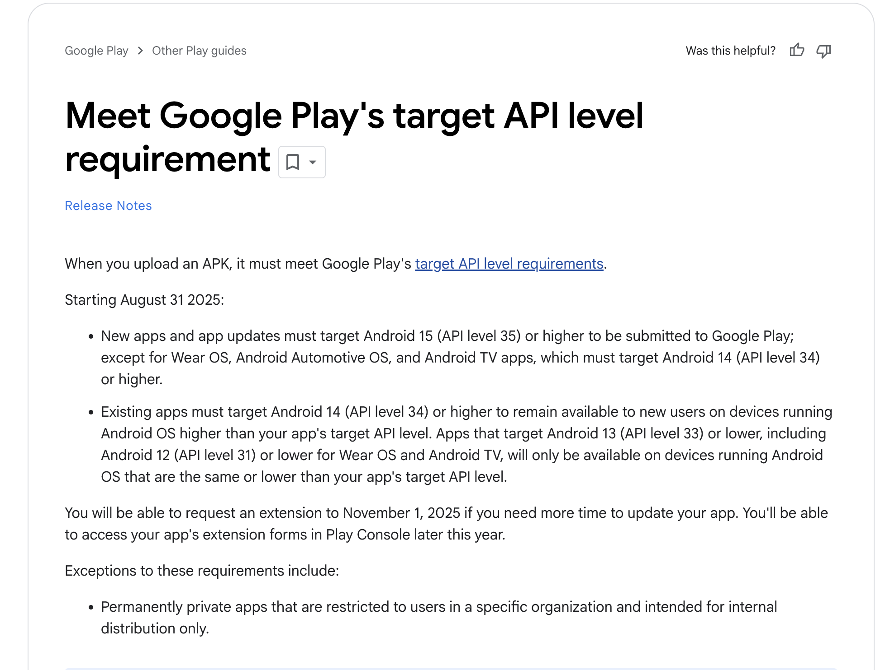

# Meet Google Play's target API level requirement

# Fixing Google Play target API failures for Expo apps (temporary workaround + permanent fix)

## What happened (the issue)

Google Play now requires apps to target recent Android API levels. Starting in late-2025 new submissions must target Android 15 (API 35) and existing apps must target at least Android 14 (API 34) to remain available to new users on newer devices. If your build is still targeting an older API level, Play will either reject uploads or progressively limit availability on devices running newer Android versions.



## Temporary (immediate) fix — update app.json

You can temporarily force the Android compile/target SDK versions via the expo-build-properties config plugin in your app.json. Upload the following app.json into studio -> src/main/webapp (or commit it to your repo) so the build system picks up API 35:

```json
{
  "expo": {
    "plugins": [
      [
        "expo-build-properties",
        {
          "android": {
            "compileSdkVersion": 35,
            "targetSdkVersion": 35
          }
        }
      ]
    ]
  }
}
```

Reference: https://docs.expo.dev/versions/latest/sdk/build-properties/

## When will this be permanently fixed?

This will be resolved in coming release with expo 52 to 53 stack upgrade